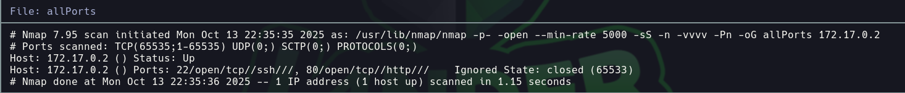

# Borazuwarahctf

Dificultad: Muy Facil
Tecnicas: Steghide - Exiftool - Hydra
Pagina: Docker labs
Estado: Listo

# 

```bash
Lo primero que hacemos es ver q puertos están abiertos 

nmap -p- -—open —min-rate 5000 -vvv -n -Pn 172.17.0.2 -oG allport
```



```bash
Luego tiramos unos script basicos y buscamos las versiones de los puertos abiertos 

nmap -p22,80 -sCV -oN targeted 172.17.0.2
```


```bash
Al abrir la web, vemos que tenemos una imagen, por lo que decidimos descargarla.
```


```bash
Vamos a utilizar steghide para extraer los datos de la imagen y vemos que tenemos un archivo secreto
```


```bash
Ahora vamos a utilizar exiftool para impeccionar los metadatos 
```


```bash
Al encontrar un usuario borazuwarah, decidimos aplicar hydra para ver encontrar su contraseña 
```


```bash
Y encontramos la contraseña -> 1234567

Ingresamos mediante ssh con el usuario y contraseña correspondiente 
```

# Subida de Privilegio


```bash

Una vez ingresado como borazuwarah, vamos a usar sudo -l para ver si tenemos alguna forma de elevar nuestro privilegio
```


```bash
Vemos que podemos ejecutar el binario bash por lo que nos respaldamos en gtfobins y elevamos nuestro privilegio
```

