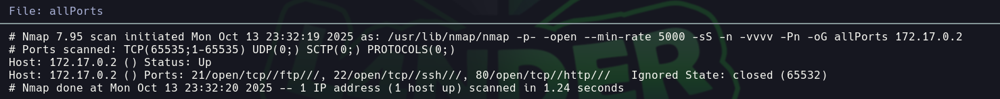

# Obsession

Dificultad: Muy Facil
Tecnicas: Ftp Anon - Hydra
Pagina: Docker labs
Estado: Listo

```bash
Lo primero que hacemos es ver q puertos están abiertos 

nmap -p- -—open —min-rate 5000 -vvv -n -Pn 172.17.0.2 -oG allport
```



```bash
Luego tiramos unos script basicos y buscamos las versiones de los puertos abiertos 

nmap -p21,22,80 -sCV -oN targeted 172.17.0.2
```


```bash
Vemos que podemos entrar como anonymous por el puerto 21 y extraemos los dos archivos 
```


```bash
Entramos en la pagina y vamos a usar el usario russoski
```


```bash
Vamos a aplicar Hydra con el usuario russoski para ver si encontramos la contraseña -> iloveme
```


```bash
Vamos a aplicar Hydra con el usuario russoski para ver si encontramos la contraseña -> ilovemeSubida de Privilegio
```

# Subida de Privilegio

```bash

Una vez ingresado como russoski, vamos a usar sudo -l para ver si tenemos alguna forma de elevar nuestro privilegio
```


```bash
Vemos que podemos ejecutar el binario vim por lo que nos respaldamos en gtfobins y elevamos nuestro privilegio
```

