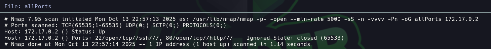

# Vacaciones

Dificultad: Muy Facil
Tecnicas: Hydra 
Pagina: Docker labs
Estado: Listo

# 

```bash
Lo primero que hacemos es ver q puertos están abiertos 

nmap -p- -—open —min-rate 5000 -vvv -n -Pn 172.17.0.2 -oG allport
```



```bash
Luego tiramos unos script basicos y buscamos las versiones de los puertos abiertos 

nmap -p22,80 -sCV -oN targeted 172.17.0.2
```


```bash
Al entrar a la pagina, vemos que tenemos un posible usuario -> Camilo
```


```bash
Vamos a aplicar HYDRA para encontrar la contraseña -> password1
```


# Subida de Privilegio


```bash
Recordamos lo que nos dijo Juan y vamos al correo y encontramos un archivo el cual cuenta con la contraseña de Juan
```


```bash
Ingresamos como Juan y usamos sudo -l para ver si tenemos alguna forma de elevar nuestro privilegio
```


```bash
Vemos que podemos ejecutar el binario ruby por lo que nos respaldamos en gtfobins y elevamos nuestro privilegio
```

